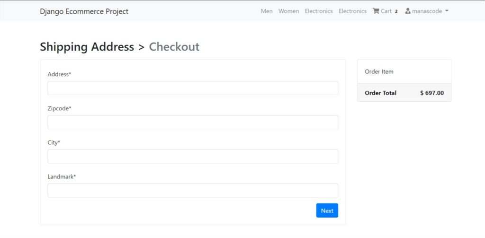
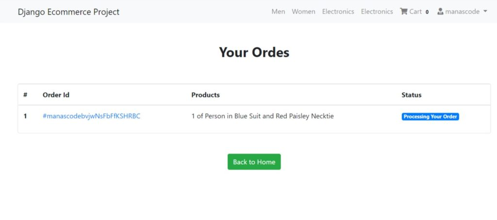

In the previous part of the Django eCommerce tutorial series, we have learnt about How we can add items to cart, increase and decrease item count, remove item from cart. And added allauth to add sign up and login activity.

In this part we are going to learn How we can add shipping address and proceed the user to checkout page to complete their order. After they complete their payment redirect them to order page where they can see their order with order status.

What we are going to learn 
---------------------------
1. **Let the user to add their shipping address before they purchase the product.**
2. **Adding the ability to use their previously used address in the current order.**
3. **Adding Stripe as a Payment gateway to make their payment**
4. **After the successful payment redirect the user to the page where they can see their previous and recent orders with the order status.**
5. **After the successful order delete all the items they have in their cart.**
6. **Showing all the Order they have**

Before you get started make sure you completed the previous first and second part. And you have a Stripe account. If you don’t have completed or read the previous posts then I would say, you must read those blog posts. https://manascode.com/django-ecommerce-website-tutorial-part-one/ , https://manascode.com/django-e-commerce-tutorial-part-two-django-allauth/ and then read this one.

And if you wanted to start from this part make sure you have clone [**`Github Repo`**](https://github.com/imanaspaul/Django-eCommerce-tutorial-manascode) so you can start from where we are going to be.

So, now let’s get started with the steps we narrate on the top.

1. Let the user to add Shipping Address
---------------------------------------

We are assuming that we are going to sell physical products in our website. So we need to let the user to add their shipping address so we can ship the product to that address.

There are plenty of ways to do that but we are going to use `Django Model Forms` to make that functionality as much as simple we can. Our motive is to let the beginners understand that how the mechanism works.

So before we do anything, we need to make a new app for the shipping and payment. In our case we called it `checkout` . I am assuming that you know how to create a new app in Django Project, so I am skipping this part for now.

After creating the app, go to the models.py file in the `<strong>checkout</strong>` app and create a model for the address. The code will be look like this. You can add more fields to the model.

```py
from django.db import models
from django.contrib.auth import get_user_model
# Create your models here.

# Get the user model
User = get_user_model()

# Billing Address Model
class BillingAddress(models.Model):

	user = models.ForeignKey(User, on_delete=models.CASCADE)
	address = models.CharField(max_length=100)
	zipcode = models.CharField(max_length=50)
	city = models.CharField(max_length=30)
	landmark = models.CharField(max_length=20)

	def __str__(self):
		return f'{self.user.username} billing address'

	class Meta:
		verbose_name_plural = "Billing Addresses"
```
Now It’s time to create the form using `<strong>Django Forms</strong>` but don’t forget to migrate the database cause we have created a new model. We can create the separate file to create the forms but for now we are making the form in **`models.py`** file. You can create the `forms.py` file add use this codes.

```py
from django.db import models
from django.forms import ModelForm # import models form form django forms
from django.contrib.auth import get_user_model
# Create your models here.

# Get the user model
User = get_user_model()

class BillingAddress(models.Model):

	user = models.ForeignKey(User, on_delete=models.CASCADE)
	address = models.CharField(max_length=100)
	zipcode = models.CharField(max_length=50)
	city = models.CharField(max_length=30)
	landmark = models.CharField(max_length=20)

	def __str__(self):
		return f'{self.user.username} billing address'

	class Meta:
		verbose_name_plural = "Billing Addresses"


# Address Form
class BillingForm(ModelForm):

	class Meta:
		model = BillingAddress
		fields = ['address', 'zipcode', 'city', 'landmark']
```

To make it simple and easy to understand, we are using just text fields but you can use ajax or some JavaScript library to make the Country fields and corresponding states fields. Now it’s time to show the form on the web page.

### Showing the Address forms

So to show the form on the checkout page we need to create the checkout view and template first. Open the views.py file in checkout app we created. and write this lines of code.

```py
def checkout(request):

	# Checkout view
	form = BillingForm
	
	order_qs = Order.objects.filter(user= request.user, ordered=False)
	order_items = order_qs[0].orderitems.all()
	order_total = order_qs[0].get_totals() 
	context = {"form": form, "order_items": order_items, "order_total": order_total}
	
	return render(request, 'checkout/index.html', context)
```


Now we have to create a templates directory in the checkout app and create a new folder called as the same name of your app. Create a new HTML file called index.html and paste this lines of codes. (Better would be if you write these lines of code by yourself instead of pasting)

But before that we are going to use the crispy forms to make the form looks much better. So stop the server and install the crispy forms package in your virtual environment.

```sh
pipenv install --upgrade django-crispy-forms
```

Now go to settings.py file and add this your installed apps and add the template pack anywhere in the settings.py file.

```py
INSTALLED_APPS = [
    'django.contrib.admin',
    'django.contrib.auth',
    'django.contrib.contenttypes',
    'django.contrib.sessions',
    'django.contrib.messages',
    'django.contrib.staticfiles',
   
    'django.contrib.sites',

    'allauth',
    'allauth.account',
    'allauth.socialaccount',
    'cart',
    'checkout',
    'products',
    'crispy_forms',
]
# Template Pack initilization
CRISPY_TEMPLATE_PACK = 'bootstrap4'
```

```html




<div class="container mt-5">
  <h2 class="mb-3">Shipping Address > <span class="text-muted">Checkout</span></h2>
  <div class="row">
    <div class="col-md-9">
     <div class="card mb-5" style="height: auto">
       <div class="card-body">
          <form method="POST">
          

         {{ form | crispy}}
          <button type="submit" class="btn btn-primary float-right">Next</button>
          </form>
       </div>
     </div>
      
      <h4>Saved Address</h4>
      <div class="card mb-5" style="height: auto">
        <div class="card-body">
          <p><b>Address :</b> {{ savedAddress.address }}</p>
          <p><b>City :</b> {{ savedAddress.city }}</p>
          <p><b>Zipcode :</b> {{ savedAddress.zipcode }}</p>
          <p><b>Landmark :</b> {{ savedAddress.landmark }}</p>
        </div>
        <div class="card-body">
           <a href="" class="btn btn-primary float-right">Proceed to Checkout with the saved Address</a>
        </div>
      </div>
      
    </div>
    <div class="col-md-3">
      <div class="card" style="height: auto">
        <div class="card-body">
         Order Items
        </div>
           <div class="card-footer">
            <span class="float-left"><b>Order Total</b></span>
            <span class="float-right"><b>$ {{ order_total | floatformat:2 }}</b></span>
          </div>
      </div>
    </div>
  </div>
</div>


```
It’s time to add the view in urls.py so first create the urls.py file in checkout app and then write this codes.

```py
from django.urls import path 
from . views import checkout

app_name = "checkout"

urlpatterns = [
	path('checkout/', checkout, name="index"),
]
```
We need to add the urls to main urls.py file we have in our project directory.

```py
from django.contrib import admin
from django.urls import path, include
from django.conf import settings
from django.conf.urls.static import static

urlpatterns = [
 	path('', include('products.urls', namespace='mainapp')),
 	path('', include('checkout.urls', namespace='checkout')),
  path('admin/', admin.site.urls),
  path('accounts/', include('allauth.urls')),
]+ static(settings.MEDIA_URL, document_root=settings.MEDIA_ROOT)
```

Everything is fine for now we should see the forms in our checkout page. Before run the server just link the checkout page in cart view page we created in the last part. I hope you can easily do this.

After run the server it will look like this.

<figure class="wp-block-image">

2. Save the Address to the Database and **Adding the ability to use their previously used address in the current order.** 
--------------------------------------------------------------------------------------------------------------------------

This step this quite complected so carefully read the step. First we need to save the from data but we also need to show saved address for the next time when then purchase something from our website. Second we have to update the previous address if they have, we don’t want to a user have multiple shipping address in our database. So having this functionality here is the code for the checkout view.

```py
def checkout(request):

	# Checkout view
	form = BillingForm
	
	order_qs = Order.objects.filter(user= request.user, ordered=False)
	order_items = order_qs[0].orderitems.all()
	order_total = order_qs[0].get_totals() 
	context = {"form": form, "order_items": order_items, "order_total": order_total}
	# Getting the saved saved_address
	saved_address = BillingAddress.objects.filter(user = request.user)
	if saved_address.exists():
		savedAddress = saved_address.first()
		context = {"form": form, "order_items": order_items, "order_total": order_total, "savedAddress": savedAddress}
	if request.method == "POST":
		saved_address = BillingAddress.objects.filter(user = request.user)
		if saved_address.exists():

			savedAddress = saved_address.first()
			form = BillingForm(request.POST, instance=savedAddress)
			if form.is_valid():
				billingaddress = form.save(commit=False)
				billingaddress.user = request.user
				billingaddress.save()
		else:
			form = BillingForm(request.POST)
			if form.is_valid():
				billingaddress = form.save(commit=False)
				billingaddress.user = request.user
				billingaddress.save()
				
	return render(request, 'checkout/index.html', context)
```
Now it’s time to Adding Stripe as a Payment gateway to make their payment.

3. Adding Stripe as a Payment gateway to make their payment 
-------------------------------------------------------------

Adding stripe is too easy than the other functionality we have created in our **eCommerce website in Django.** So first of all we need install the Stripe package in our project.

```sh
pipenv install stripe
```

> Make sure you have a Stripe Account. For Indian user Stripe doesn’t support yet but you can use your test account to do that for now.

### Get the API keys from stripe Dashboard.

Login to your stripe account and go to developer tab then get those two api key one is publishable key another one is secret key. Now open settings.py file add the secret key. ( You can use environment variable to store those keys)

```py
STRIPE_SECRET_KEY = 'your test secret key'
STRIPE_PUBLISHABLE_KEY = 'your test publishable key'
```


So now we need to create the payment page view. In `<strong>views.py</strong>` file create a new view called payment.

```py
# Import Stripe
import stripe
from django.conf import settings

def payment(request):
	key = settings.STRIPE_PUBLISHABLE_KEY
	order_qs = Order.objects.filter(user= request.user, ordered=False)
	order_total = order_qs[0].get_totals() 
	totalCents = float(order_total * 100);
	total = round(totalCents, 2)
	if request.method == 'POST':
		charge = stripe.Charge.create(amount=total,
            currency='usd',
            description=order_qs,
            source=request.POST['stripeToken'])
		
        
	return render(request, 'checkout/payment.html', {"key": key, "total": total})
```
We need to import the settings and Stripe first. Then we are using `stripe.Charge` functions to charge the user. We are going to use Stripe Payment which is already made by Stripe to make our work flow simple and easier.

[**For more info checkout the Stripe Documentation &gt;&gt;** ](https://stripe.com/docs)

Add the **payment** function to the `urls.py` file to navigate to the route.

```py
from django.urls import path 
from . views import checkout, payment

app_name = "checkout"

urlpatterns = [
	path('checkout/', checkout, name="index"),
	path('payment/', payment, name="payment"),
]
```
Now create a new HTML file for **`payment.html`** and now paste this codes.

```html




<div class="container mt-5 text-center">
<h2>Pay with Stripe</h2>
<form action="" method="post">
  
  <script src="https://checkout.stripe.com/checkout.js" class="stripe-button"
    data-key="{{ key }}"
    data-description="Complete your order"
    data-amount="{{ total }}"
    data-locale="auto">
</script>
</form>

</div>


```

To make things much clear to you we are going to create a new function called charge and which will going to handle the payment and let us know that the payment is successful or not.

So to call the charge function we are using the form action and points to charge url ( we have not created yet ).

```py
def charge(request):
	order = Order.objects.get(user=request.user, ordered=False)
	order_total = order.get_totals() 
	totalCents = int(float(order_total * 100));
	if request.method == 'POST':
		charge = stripe.Charge.create(amount=totalCents,
            currency='usd',
            description=order,
            source=request.POST['stripeToken'])
		if charge.status == "succeeded":
			orderId = get_random_string(length=16, allowed_chars=u'abcdefghijklmnopqrstuvwxyzABCDEFGHIJKLMNOPQRSTUVWXYZ0123456789')
			print(charge.id)
			order.ordered = True
			order.paymentId = charge.id
			order.orderId = f'#{request.user}{orderId}'
			order.save()
			cartItems = Cart.objects.filter(user=request.user)
			for item in cartItems:
				item.purchased = True
				item.save()
		return render(request, 'checkout/charge.html')

```
In this charge function first we are getting the order object that the requested has. Then we are getting the order total to set the charge amount. Remember one thing that the charge amount should be an Integer value not floating value.

Strite charge the values in cents so we are converting the total amount to cents and making sure that value store in `int` in `totalCents` variable.

Again we are using the Charge method from stripe to charge the user.

4. Handling the successful payment.
-----------------------------------

To check the payment is successful or not you can print the `charge ` to see the details or you can check the stripe dashboard under payments. It should look like this.


After the successful payment we have to mark the order as `<strong>True</strong>` that we have by default **`False`**. But we also need to make an order ID to allow the user to track their order status. And we have to store the payment id that will going to return after the Charge methods.

Another thing we wanted to do is mark the Cart Items as purchased. So first we are just making the order as True. Now the next step is creating the unique ID, so we are using **`get_random_string`** from **`django.utils.crypto`** to generate the random string. After that we are saving the order object.

> Remember one thing we have added two new fields in the Order model called `paymentId, orderId`. And a new field for the **`purchased`** which is by default is False.

We are just saving the order object and cart objects then render the **`charge.html`** page. You can design the charge page anything you want. But I like to make things much simple to learn.

<div class="hcb_wrap">```
<pre class="prism line-numbers lang-html" data-file="checkout/charge.html" data-lang="HTML">```




<div class="container mt-5 text-center">
<h2 class="text-center">Thanks, you for your Orders</h2>
<a href="/my-orders" class="btn btn-success">My Orders</a>
</div>


```
I made a button to go to the My Order Page where I basically show all the orders they have.

5. Showing all the Order they have 
-----------------------------------

To show all the order the user has, we need a view for that so let’s create a view called **`oderView`**. Here is the all code for the new view.

```py

def oderView(request):

	try:
		orders = Order.objects.filter(user=request.user, ordered=True)
		context = {
			"orders": orders
		}
	except:
		messages.warning(request, "You do not have an active order")
		return redirect('/')
	return render(request, 'checkout/order.html', context)
```
In this view we are using try and except to handle the errors. Now create new html file to show the order they have. In our case we are calling as **`order.html`**

```html




<div class="container mt-5">
<h2 class="text-center"><strong>Your Ordes</strong></h2>
<div class="row">
	<div class="col-md-12">
		<div class="card mt-5" style="height: auto">
			<div class="table-responsive">
			<table class="table">
			  <thead>
			    <tr>
			      <th scope="col">#</th>
			      <th scope="col">Order Id</th>
			      <th scope="col">Products</th>
			      <th scope="col">Status</th>
			    </tr>
			  </thead>
			  <tbody>
			    
			    
			    
			    <tr>
			      <th scope="row">{{ forloop.counter }}</th>
			      <td><a href="#">{{ order.orderId }}</a></td>
			      <td>
			      	
			      		{{ item }}
			      		<br>
			      	
			      </td>
			      <td><span class="badge badge-primary">Processing Your Order</span></td>
			  	</tr>
			      
			    
			  </tbody>
			</table>
			</div>
		</div>
	</div>
	<div class="col-md-12 my-5 text-center">
		<a href="/" class="btn btn-success">Back to Home</a>
	</div>
</div>
</div>


```
After all these successfully done. The website should look like this.

 

We are using a lots of Function based views but I think that would help you understand the logic in much easier way. But don’t worry we are going to convert this into Class Based View soon. You can take the challenge to convert these function based view to Class based views and make a pull request our Github repo.

To get more clear reference make sure you clone the or fork the repo to you github.

https://github.com/imanaspaul/Django-eCommerce-tutorial-manascode

We have lots of things to do in the next part like working on the Order status, handling the stripe errors, improving our website design using bootstrap and many more. Suggest us some functions that you think for the eCommerce website.

In this part if you are facing any issue ask you question in the comment section and if I miss anything please let me know I can fix that soon.

Please share this post if you like and comment down below you learning progress.

Thank You
