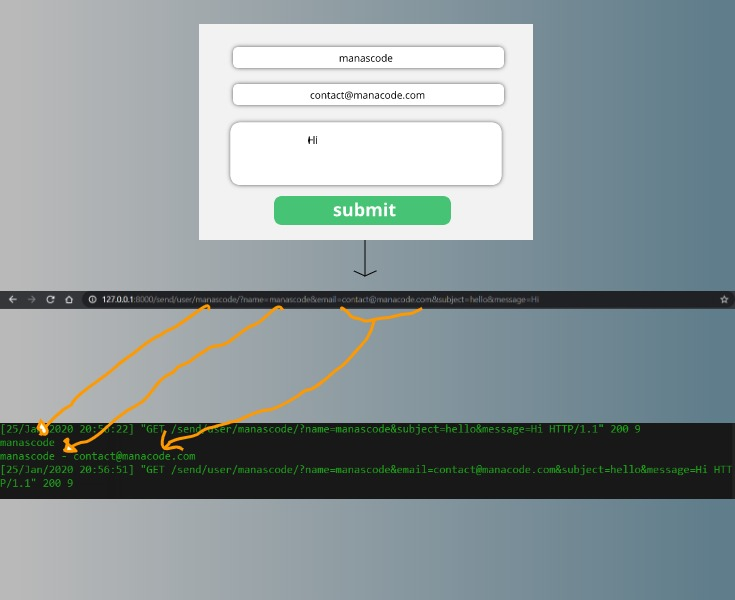
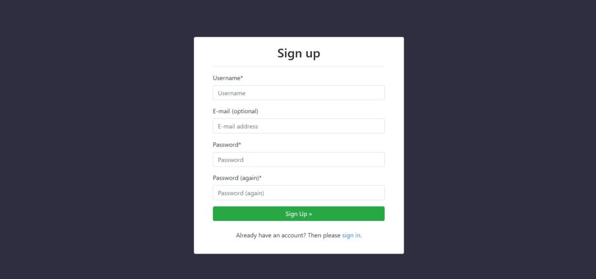

So in this part, we are going to start **Building SAAS application in Django** 🎉. Although we talked about what we are going to build in brief in the [`Introduction Part`](https://manascode.com/build-a-saas-application-in-django-3-saas-series/)` `of this series.

So we will first start with discussing the plan in details so you understand it pretty well.

Before we start this part, let me tell you one thing for this series you have to have some basic knowledge of **Django**, how a **Django application** work and how to make a basic blog. We also have the covered the **eCommerce tutorial in Django**.

So if you haven’t go through those tutorial then I would suggest you to practice them before you start this one. Here are those **written tutorial about Django**.

- [Adding search filters in Django eCommerce website](http://manascode.com/adding-search-filters-in-django-ecommerce-website/)
- [Real world SAAS application in Django tutorial](http://manascode.com/real-world-saas-application-in-django-tutorial/)
- [Build a SaaS Application in Django 3.0| SaaS Series](http://manascode.com/build-a-saas-application-in-django-3-saas-series/)
- [Stripe Payment Gateway Integration in Django eCommerce Website](http://manascode.com/stripe-payment-gateway-integration-in-django-ecommerce-website/)
- [Django eCommerce tutorial part two](http://manascode.com/django-ecommerce-tutorial-part-two-django-allauth/)

So let’s start with the plan first and then we will go write some codes to make our hands dirty to Build SAAS application in Django . 😃🎉

1. Planing the whole Application.
---------------------------------

As we have talked about the application in the previous part, we are going to make a contact form email receiver for static websites. Something that <https://formspree.io/> does.

To make something like this, First of all I thought make a the app will be without REST API. Where use have different pricing plans to choose and based on their plan,they can have their personal end point or a html from. Which will handle that request in the view and based on that we will update the notification and other stuff as well.

But to make it more advance application, we ae going to make the REST API’s as well. So we can reach other platform user like iOS, Android etc.

> Overall idea is, an user can sign up in our website ( of course we will have subscription plans ) and after completing all the necessary steps they can use the html form that will be generated automatically from our server. Or they can use the API end point to make the contact form working in their static websites.

2. Making the Project with pipenv
---------------------------------

I am assuming you know, how to create the django project and how django works. So I am skipping these steps of creating virtual environment. And installing the django dependency and make a project inside the virtualenv.

After creating the project it will look like this

```py
   manage.py
   Pipfile
   Pipfile.lock
  
   backend
        asgi.py
        settings.py
        urls.py
        wsgi.py
        __init__.py
```

I am calling the project as `<strong>backend</strong>` cause, I have some plan to make a `<strong>frontend</strong>` application with `React or Vue`. Now it’s time to create the an app to get started. In my case I called the app as **`message`** and now let’s create the model first to get started coding.

3. Creating Models
------------------

Before creating the models we need to know what kind of data we need to store in the database. First of all we need to store the user’s emails and every email will have **first name, last name, email (sender email), and owner( user of our application )**.

Secondly we want to store how many emails that a user have got in their inbox, so to count that we need a **count field**, **email** ( that has been sent to the user ) and of course the **userid** as **foriegnkey**.

Here is the final code for **message/models.py** file :

```py
from django.db import models
from django.contrib.auth.models import User


# User's contact form model

class Message(models.Model):

	fname = models.CharField(max_length=40)
	lname = models.CharField(max_length=40)
	subject = models.CharField(max_length=100)
	body = models.TextField(max_length=1000)
	owner = models.ForeignKey(User, on_delete=models.CASCADE)


	def __str__(self):

		return f"{self.owner.username}'s mail {self.subject}"


# Email sending Count

class CountEmail(models.Model):

	count = models.IntegerField(default=0)
	owner_email = models.EmailField(max_length=254)
	owner = models.ForeignKey(User, on_delete=models.CASCADE)

	def __str__(self):
		return f"{self.owner}'s count is {self.count}"
```


> Now after creating the **`models.py`** file don’t forget to migrate the database. Maybe you could get an error if you don’t add the app name under the **`settings.py`** file.

4. Creating views
-----------------

It’s time for the most important part of our application. Now we have to think how could we solve the problem of sending contact form’s data to owner’s email.

In our case our first approach is to provide a form where user can submit their message and the message will be send to the owner of that contact form. So to do that, we are going to use **query parameters** of url.

If you don’t know what it is, it’s simple you have seen a lot while surfing the internet. if you search on google you will see the your bar will look something like this.

```sh
https://www.google.com/search?q=django
```


**search?q=django** that is the query parameter. Even when click on a HTML form submit button, all the data goes to the action url as an query parameters form. so we are going to take that advantage to solve that problem.

Here is the **message/views.py** file code

```py

def sendmail(request, id):

	# collect the querry parameters that has been send from the client
	print(id)
	name = request.GET.get("name")
	email = request.GET.get("email")
	#	context = {""}
	return HttpResponse("Send mail")
```
In the view we are using the id parameter to check which user email has been submitted. Now if you print the name and email you will see the the exact same result you have set in the url.

We will check that after map the url of the view that we just created.

5. Mapping the urls
-------------------

To map the url, create a new urls.py file in the apps directory and write the path into the `urlpatterns` list. So easy stuff you could do again if anyone new to django just these lines of code to the urls.py file.

Here is the **`message/urls.py`** code :

```py
from django.urls import path
from . views import sendmail, success


app_name = "sendmessage"

urlpatterns = [
	path('user/<id>/', sendmail, name='sendmail'),
]

```

In the urls.py file we have wrote the app\_name cause it’s required to have to use the `include` argument, even it also helps us to when we are using url tag in the template and other various places. You can read more about in details in **[Django documentation](https://docs.djangoproject.com/en/3.0/topics/http/urls/#namespaces-and-include)**[.](https://docs.djangoproject.com/en/3.0/topics/http/urls/#namespaces-and-include)

If you noticed carefully, I have used **`id`** parameter in the url. It will help us to know which user’s form has been submitted. Depending on that request we will going to notify to the corresponding user. I hope till now all it makes sense. Check the below image it will make more sense to you.


Building SAAS application in Django After submitting the form, the forms data will be passed to the url as url parameters. We will going to grab this data to work with. Later on we will implement **REST API endpoint** to make the application more advance.

before going further in the view we now need to have the authentication added in our application. So let’s get into the next step.

6. Adding Authentication in Django
----------------------------------

In our application we don’t want to use the default django authentication. We need some more features like social login to make it more user friendly.

We could make our custom django user model and also use Google, Facebook Oauth in authentication but that will be take alots of time and effort. So to make it easier we are going to use our magician **Django Allauth**. So let’s do this.

I have already wrote a tutorial about how to integrate Django Allauth in Django appication. If you have not read that yet go to this url &gt; <https://manascode.com/django-ecommerce-tutorial-part-two-django-allauth/>

So simple steps so I am not going to write that again to make the post lengthy. Even you can follow the Django-allauth documentation page to read about that. I am going to show the way **how you can customize the Django allauth default Login and Sign Page**.

7. Customizing the Signup and Login Page
----------------------------------------

According to Django allauth we need to create a **`templates`** directory on the root of our project. Then in the templates folder create a new folder called account and then in that folder we have create those html templates to work with. Remember we have follow the same naming convention otherwise it won’t work.

> Don’t forget to add the template directory in the **`settings.py`** file

```py

TEMPLATES = [
    {
        'BACKEND': 'django.template.backends.django.DjangoTemplates',
        'DIRS': [os.path.join(BASE_DIR, 'templates')],
        'APP_DIRS': True,
        'OPTIONS': {
            'context_processors': [
                'django.template.context_processors.debug',
                'django.template.context_processors.request',
                'django.contrib.auth.context_processors.auth',
                'django.contrib.messages.context_processors.messages',
            ],
        },
    },
]

```
Now inside that account folder create a new html file called base.html, we are going to extend that file for all that account related html file we will be create in the future.

### Customizing Django allauth pages

Here is `templates/account/base.html` code :

```html
<!doctype html>
<html lang="en">

<head>
    <!-- Required meta tags -->
    <meta charset="utf-8">
    <meta name="viewport" content="width=device-width, initial-scale=1, shrink-to-fit=no">

    <!-- Bootstrap CSS -->
    <link rel="stylesheet" href="https://stackpath.bootstrapcdn.com/bootstrap/4.4.1/css/bootstrap.min.css" integrity="sha384-Vkoo8x4CGsO3+Hhxv8T/Q5PaXtkKtu6ug5TOeNV6gBiFeWPGFN9MuhOf23Q9Ifjh" crossorigin="anonymous">
    <script src="https://cdn.jsdelivr.net/npm/sweetalert2@9"></script>
    <title></title>
     
    <style>
        body {
            width: 100%;
            height: 100vh;
            background-color: #2F2E41;
        }
    </style>
</head>

<body>
      
    <script>
        const Toast = Swal.mixin({
            toast: true,
            position: 'top-end',
            showConfirmButton: false,
            timer: 3000,
            timerProgressBar: true,
            onOpen: (toast) => {
                toast.addEventListener('mouseenter', Swal.stopTimer)
                toast.addEventListener('mouseleave', Swal.resumeTimer)
            }
        })

        Toast.fire({
            icon: 'success',
            title: {
                {
                    message
                }
            }
        });
    </script>
          
    <!-- Optional JavaScript -->
    <!-- jQuery first, then Popper.js, then Bootstrap JS -->
    <script src="https://code.jquery.com/jquery-3.4.1.slim.min.js" integrity="sha384-J6qa4849blE2+poT4WnyKhv5vZF5SrPo0iEjwBvKU7imGFAV0wwj1yYfoRSJoZ+n" crossorigin="anonymous"></script>
    <script src="https://cdn.jsdelivr.net/npm/popper.js@1.16.0/dist/umd/popper.min.js" integrity="sha384-Q6E9RHvbIyZFJoft+2mJbHaEWldlvI9IOYy5n3zV9zzTtmI3UksdQRVvoxMfooAo" crossorigin="anonymous"></script>
    <script src="https://stackpath.bootstrapcdn.com/bootstrap/4.4.1/js/bootstrap.min.js" integrity="sha384-wfSDF2E50Y2D1uUdj0O3uMBJnjuUD4Ih7YwaYd1iqfktj0Uod8GCExl3Og8ifwB6" crossorigin="anonymous"></script>
</body>

</html>
```
In the base.html I am using Bootstrap 4 for rapid ui development and we are using **[sweetalert2](https://sweetalert2.github.io/)** to show some cool animation on when message coming.

Here is `templates/account/login.html` code :

```html







<section class="container pt-5">
   <div class="row pt-5">
   	<div class="col-md-6 offset-md-3">
   		<div class="card text-center">
   			<div class="card-body px-5">
   				<h2>Login</h2>
   				<hr>
	   				<form class="signup text-left" id="signup_form" method="post" action="">
					  
					  {{ form | crispy }}
					  
					  <input type="hidden" name="{{ redirect_field_name }}" value="{{ redirect_field_value }}" />
					  
					  <button class="btn btn-success form-control " type="submit"> »</button>
					</form>
					<br>
					<p>Already have an account? Then please <a href="{{ signup_url }}">sign in</a>.</p>
   			</div>
   		</div>
   	</div>
   </div>
</section>

```
Here is `templates/account/signup.html` code :

```html








<section class="container pt-5">
   <div class="row pt-5">
   	<div class="col-md-6 offset-md-3">
   		<div class="card text-center">
   			<div class="card-body px-5">
   				<h2>Sign up</h2>
   				<hr>
	   				<form class="signup text-left" id="signup_form" method="post" action="">
					  
					  {{ form | crispy }}
					  
					  <input type="hidden" name="{{ redirect_field_name }}" value="{{ redirect_field_value }}" />
					  
					  <button class="btn btn-success form-control " type="submit"> »</button>
					</form>
					<br>
					<p>Already have an account? Then please <a href="{{ login_url }}">sign in</a>.</p>
   			</div>
   		</div>
   	</div>
   </div>
</section>

```


After successfully write all these code when you run the project you may get some error cause we are using the crispy forms to have the bootstrap style on those forms.

> So to make sure you have installed the crispy forms and configured it properly.

If you don’t know how to do that either you can go to their [official documentation](https://django-crispy-forms.readthedocs.io/en/latest/) or you can check the `github repo` of this project. I will link it in the end of the post.

After you done everything properly the signup form should look like this. You could also make your own design.



Now it seems the post going to long so I am going to stop this for now, Rest of the Building SAAS application in Django tutorial will be published in part. If you find any kind of typo please let me know in the comment and of course if you think you could add more feature or we could, please write those ideas in the comment.

If you have not liked our facebook page where we share some cool resource of learning django and other programming language. Here is the facebook page link **https://facebook.com/manascodes**

One more thing if you think that this tutorials are helpful for you please appreciate us and share with you friends so we can get motivation to write more tutorial for you.

Here is the Github repository for Building SAAS application in Django : **<http://bit.ly/2uyjXH0>**