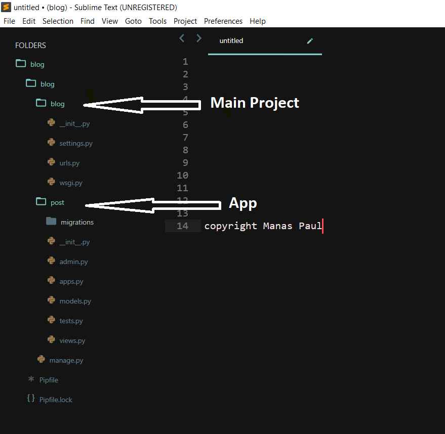
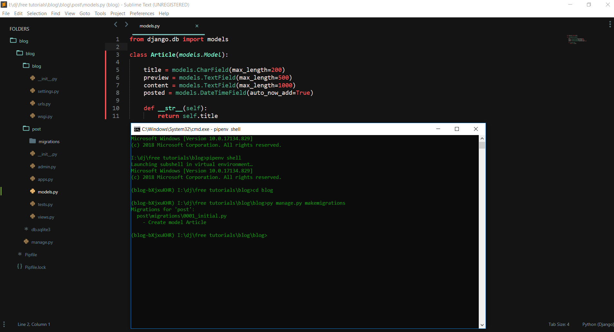
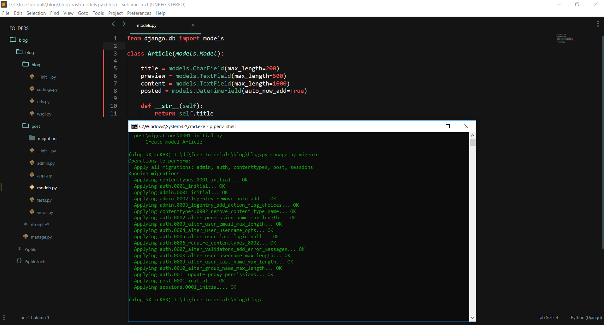
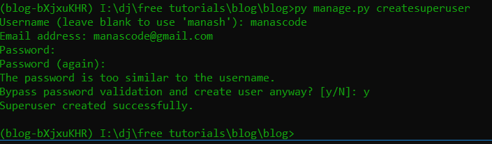
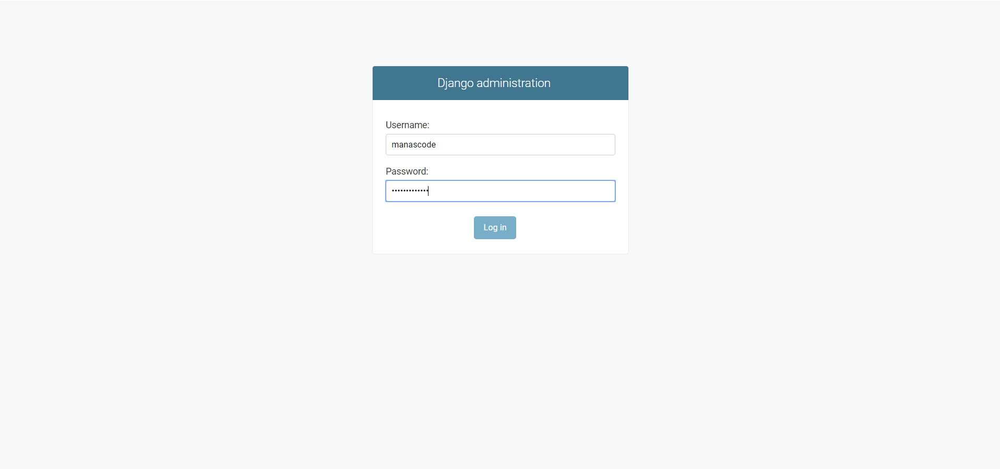
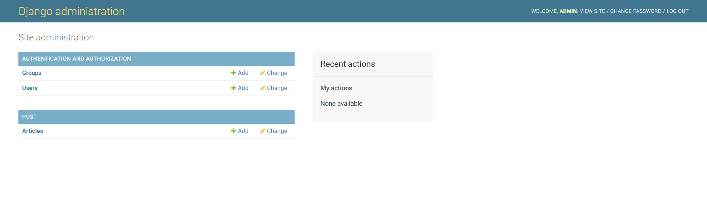
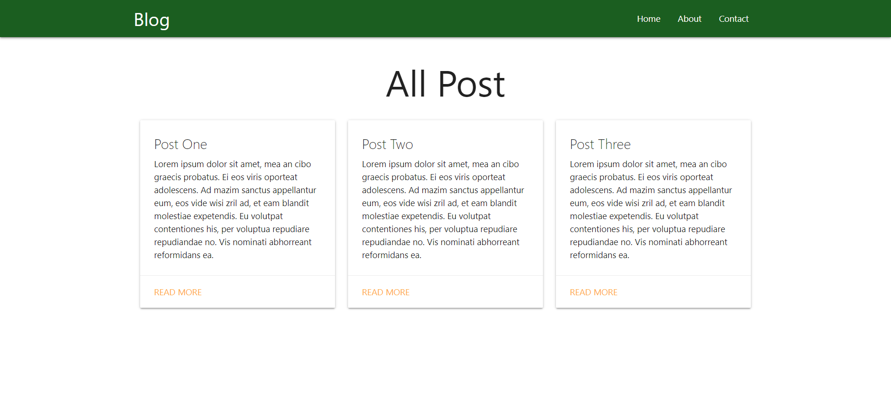
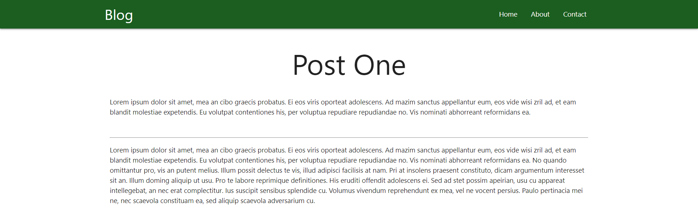

In this Free Tutorial, We are going to start **Create a Blog using Django**. You can create most powerful web based application using Django rather than creating a Blog. But to **learn Django from scratch**, we need to focus on the basics on Django.

> For this Free Tutorial we are assuming that you know the basics of **Python Programming Language**. If you don’t know Python then feel free to close the tab and learn the basics of Python from other resources.

> I personally recommended **Sentdex youtube channel** or you go to his website [pythonprogramming.net ](https://pythonprogramming.net/) to learn the basics of Python and then you can get back to this tutorial series.

So Now web are going to start our Tutorial step by step. To **make a basic Blog in Django**, we need to have some requirements to get stated.
#### Here are those requirements:

- [x] **Python 3** or above version is installed in your Machine
- [x] Python’s package manager **PIP** is installed
- [x] **A code editor or IDE** ( In this tutorial we are going to use Sublime Text, but you can use any kind of code editor you like. for example : VS CODE or PyCharm or any kind of IDE )
- [x] And of course your **time** and **patience** 😃

Now let’s get started.

#### **Step One :**

First of all through out this tutorial I am going to use Windows Machine but you can use any kind of OS you want just make sure you have those requirements in you machine.

Now create a new folder called Blog and open the terminal or command prompt in that folder. If you are using VS CODE or any other IDE it will be the same just open the terminal and navigate to the folder you just created.

To **create a blog in django**, we need to create a virtual environment in that folder. To create the virtual environment type this following command in your terminal.

```sh
pipenv shell
```
It will create a virtual environment in that folder. Now you can create Install Django in this virtual environment. To install django type the following command in you terminal.

```sh
pipenv install django
```

#### Step two:

It will install the latest version of Django in your virtual environment. Now type the following command. In the following code we tell django that create a project for us with the name of **blog**. You can name it anything you want.

```sh
django-admin startproject blog
```


Now the folder structure will be like this. by default Django create a New folder with the name of blog. Inside the blog folder Django creates the main project. The project will contains few folders and few files in it. So now the next step is to navigate into the project folder that means you are now in the virtual environment base directory. To navigate to the type following command.

```sh
cd blog
```


Now you are in the project directory. To make a basic blog we can use the project instead of creating an app for that. But to be with the **[official documentation of Django](https://docs.djangoproject.com/en/2.1/)** we need to create an app for the specific functionality in our blog. A blog will contains a lots of posts so we will call the app as post. So create an app in the project directory we need to type the following command in the terminal.

```sh
python manage.py startapp post
```



Folder Structure after go through all of the commands

Now the folder structure will be like this. It’s time to get our hands dirty 😃. In any code editor open the main blog folder we created in the first step. First of all we need to install or link the app to project we created.

Now you can run this command to run the Server to see your by blank Django project in the browser.

```sh
python manage.py runserver
```
After running the server you can see the Django website in your browser by going this url. <http://127.0.0.1:8000/>

So to do that we need to open the **settting.py** file in the project ( blog folder ) folder and type the name name of our app in the installed app section to install or link up our app with the project.

#### Step three:

Before we get into more in depth of our Django blog. we need to know something about Django now.

 Django is backend framework based on Python. django follows **MVT software design pattern**. In a simple way to understand is when we request a url it will go the view first in the backend. then it will search those models which are defined in the views file in a django project. After getting all the requested models it gives back a response to the template which we can see in the browser.

In this step we are going to install our App to our Porject. To do that just open the **settings.py** file in our Project Blog folder. Now write down the app name in **INSTALLED\_APPS** list.

```py
INSTALLED_APPS = [
    'django.contrib.admin',
    'django.contrib.auth',
    'django.contrib.contenttypes',
    'django.contrib.sessions',
    'django.contrib.messages',
    'django.contrib.staticfiles',

     # Our App
    'post'
]

```
#### Step four:

Now we need to create our Model for our posts. So to do that just open the **models.py** file in the editor and type these following commands.

```py
from django.db import models

# Article Model
class Article(models.Model):

	title = models.CharField(max_length=200)
	preview = models.TextField(max_length=500)
	content = models.TextField(max_length=1000)
	posted = models.DateTimeField(auto_now_add=True)

	def __str__(self):
		return self.title
```
In these above code we are creating a model for our post to represent for each post has these title, preview text and main content in the database. To know more about these Fields in Django you can read the [Model field reference ](https://docs.djangoproject.com/en/2.2/ref/models/fields/) in django doc.

Now it’s time to add these fields in out database. For that django has a command for that. Just type **python manage.py makemigrations** in your terminal in the project directory make sure your virtual environment is activated. If you server is running then you can use **ctrl + c** ( for windows) to close out the server. It means every time you create a model or change a model you have to run the command t take affect in your database.

Now after run the command it looks like this.



python manage.py makemigrations

>Now type another command to migrate the fields in the database. The command is **python manage.py migrate**. Now after this should look like this.



python manage.py migrate

By default Django has some predefined models. With that migrate command they also be migrated to the database. This will only happened if you are running these two commands for the first time after creating the project.

#### Step five:

Now in this step we need create some posts to work with. To do that we need forms in general but by default Django has a nice admin interface to work form the browser to some CRUD ( CRUD means create, read, update, delete ) task to our database.

So to achieve the admin interface we need follow some steps to get that up and running. Now go to your **admin.py** file in your **post** app and write these lines of codes.

```py
from django.contrib import admin
from . models import Article

# To register this Article Model in our Admin interface
admin.site.register(Article)
```
Now we are good to go. Let’s run the server again to see the affect in admin panel. After running the server now go to <http://127.0.0.1:8000/admin> but now django required username and password to login. But we don’t have that. So let’s create that now.

To create a Admin user in Django terms it’s called super user we need to type some commands to to that. So first of all close the server with **ctrl+c** and then type **python manage.py createsuperuser**

#### Creating Super User:

```py
 python manage.py createsuperuser
```


Now Django will ask you some required fields like username email and password after doing that you should see something look like this.



py manage.py createsuperuser

#### Step four:

Now let’s run the server again by **python manage.py runserver** and the server will start again in port **127.0.0.1:**[8000](http://127.0.0.1:8000). Just open the server in your browser and navigate to **[127.0.0.1:8000/admin ](http://127.0.0.1:8000/admin%20)**.



Django built in Admin Interface
Fill the credentials that you given when you were creating the Superuser and login. Then you will see something like this.



Now just add few **Articles** or **Post** to work with. After adding some let’s get get back to the code again. Now to show all the posts that we added from the backend or Admin interface, We need to create some views for that. One is for show all the Post in Home page. Another is to show the details of the post when someone clicks to see the full post.

#### Step five: 

To create the first view we need to import few methods. First one is **render method** and the Article model it self from the post app.

```py
from django.shortcuts import render
from .models import Article
```

**Django render method:** allows us to pass dictionary to template through HttpResponse.

Now in this tutorial we are using **Django function based views** to **creating a view**. Here is the first function to show all the posts from our database.

```py
# All Post View:
def all_post(request):
	posts = Article.objects.all()
	return render(request, 'post/index.html', {'posts': posts})
```


In this function we are getting the all the posts by calling the **Articale.objects.all()** method and we are storing all the posts in a **posts** variable. Then we are just rendering the index.html file and passing all the posts in a **dictionary format** with the key of **posts**.

#### Creating the template:

To create the template we need to create a folder called **Templates** in the **post** app and again another folder into folder named with the app name. In case our app name is **post**. Now create a html file named **index.html**.

```sh
# The folder structure will be like this 
    post
    -Templates
        -post
            -index.html
```


And here is the index.html code, In that tutorial we are not focusing on the designing part. We are just using **Google’s Materializecss Framework** to get work done faster.

```html

<html>
   <head>
      <!--Import Google Icon Font-->
      <link href="https://fonts.googleapis.com/icon?family=Material+Icons" rel="stylesheet">
      <!-- Compiled and minified CSS -->
      <link rel="stylesheet" href="https://cdnjs.cloudflare.com/ajax/libs/materialize/1.0.0/css/materialize.min.css">
      <!--Let browser know website is optimized for mobile-->
      <meta name="viewport" content="width=device-width, initial-scale=1.0"/>
   </head>
   <body>
      <nav>
         <div class="nav-wrapper green darken-4">
            <div class="container">
               <a href="/" class="brand-logo">Blog</a>
               <ul id="nav-mobile" class="right hide-on-med-and-down">
                  <li><a href="/">Home</a></li>
                  <li><a href="/about">About</a></li>
                  <li><a href="/contact">Contact</a></li>
               </ul>
            </div>
         </div>
      </nav>
      <div class="container">
         <h1 class="center-align">All Post</h1>
      </div>
      <div class="container">
         <div class="row">
            
            <div class="col s12 m4">
               <div class="card ">
                  <div class="card-content ">
                     <span class="card-title">	{{ post.title }}</span>
                     <p>{{ post.preview }}</p>
                  </div>
                  <div class="card-action">
                     <a href="/post/{{ post.id }}">Read More</a>
                  </div>
               </div>
            </div>
            
         </div>
      </div>
      <!--JavaScript at end of body for optimized loading-->
      <script src="https://cdnjs.cloudflare.com/ajax/libs/materialize/1.0.0/js/materialize.min.js"></script>
   </body>
</html>
```

In this page to show the posts in the page we need to use Django templating syntax. Now we need to to loop through all the posts in the database, for that we used a for loop looks something like this.

```py
  
            <div class="col s12 m4">
               <div class="card ">
                  <div class="card-content ">
                     <span class="card-title">	{{ post.title }}</span>
                     <p>{{ post.preview }}</p>
                  </div>
                  <div class="card-action">
                     <a href="/post/{{ post.id }}">Read More</a>
                  </div>
               </div>
            </div>

```

Now we need to set the urls to handle the http requests. So to do that create a new file in the post app directory called urls.py and paste the following codes.

```py
from django.urls import path 
from . views import all_post

urlpatterns = [
	path('', all_post, name="all_post"),
]
```

Now to map this url to current project we need to write few lines of codes in the **urls.py** file in the project directory

```py
from django.contrib import admin
from django.urls import path, include

urlpatterns = [
    path('', include('post.urls')),
    path('admin/', admin.site.urls),
]

```

In the above codes we are just importing the **include** method to map the urls in the app directory. Then in the **urlspatterns** we are just saying that everything in the blank root points to the **post app’s urls.py** file.

After saving all the files now refresh the page in the browser, you will see something like this.


Make a blog with Django

####  Step six: 

Now we need to create the second view for the details page. So the same stuff again need to import one method is **get\_object\_or\_404**.

> **get\_object\_or\_404** method is help us to handle the request when the requested object was not found in the database.

```py
from django.shortcuts import render, get_object_or_404
from .models import Article
```

Now the details view will be look like this. Just paste the code under the all posts view.

```py
# Post Detail View:
def post_detail(request, id):
	post = get_object_or_404(Article, id=id)

	return render(request, 'post/post_detail.html', {"post": post})
```


Again we have to add the url to handle the post details http request.

```py

from django.urls import path 
from . views import all_post, post_detail

urlpatterns = [
	path('', all_post, name="all_post"),
	path('post/<int:id>/', post_detail, name="post_detail")
]
```


In the above code we are passing the post id after the **post/** and with that request we are querying the database with the help of **get\_object\_or\_404** method.

Now we need to add the anchor tag to all the post to allow the user to click on any posts to navigate to the details page of that post. For that we are now hard coded the url but in the next part we will use a robust way to do that.

> We have already did that in **index.html** page. Just look at the code again. You don’t need to do that again.

```html
<a href="/post/{{ post.id }}">Read More</a>
```

Everything is almost setup except the Post detail page. So just create the **post\_detail.html** file in the same folder as we did for the index.html page. After creating the page just paste these lines of codes.

```html

<html>
   <head>
      <!--Import Google Icon Font-->
      <link href="https://fonts.googleapis.com/icon?family=Material+Icons" rel="stylesheet">
      <!-- Compiled and minified CSS -->
      <link rel="stylesheet" href="https://cdnjs.cloudflare.com/ajax/libs/materialize/1.0.0/css/materialize.min.css">
      <!--Let browser know website is optimized for mobile-->
      <meta name="viewport" content="width=device-width, initial-scale=1.0"/>
   </head>
   <body>
      <nav>
         <div class="nav-wrapper green darken-4">
            <div class="container">
               <a href="/" class="brand-logo">Blog</a>
               <ul id="nav-mobile" class="right hide-on-med-and-down">
                  <li><a href="/">Home</a></li>
                  <li><a href="/about">About</a></li>
                  <li><a href="/contact">Contact</a></li>
               </ul>
            </div>
         </div>
      </nav>
      <div class="container">
         <h1 class="center-align">{{ post.title }}</h1>
      </div>
      <div class="container">
         <div class="row">
            <div class="col s12 m12">
               <p>{{ post.preview }}</p>
               <br>
               <hr>
               <p>{{ post.content }}</p>     
            </div>
         </div>
      </div>
      <!--JavaScript at end of body for optimized loading-->
      <script src="https://cdnjs.cloudflare.com/ajax/libs/materialize/1.0.0/js/materialize.min.js"></script>
      
   </body>
</html>
```

Now save all the files and make sure that your server is running. if not then just restart the server and It will be look like this.


Post details page
> Thanks for reading the post. If you have any question or if you think anything is missing please let me know in the comment section.
