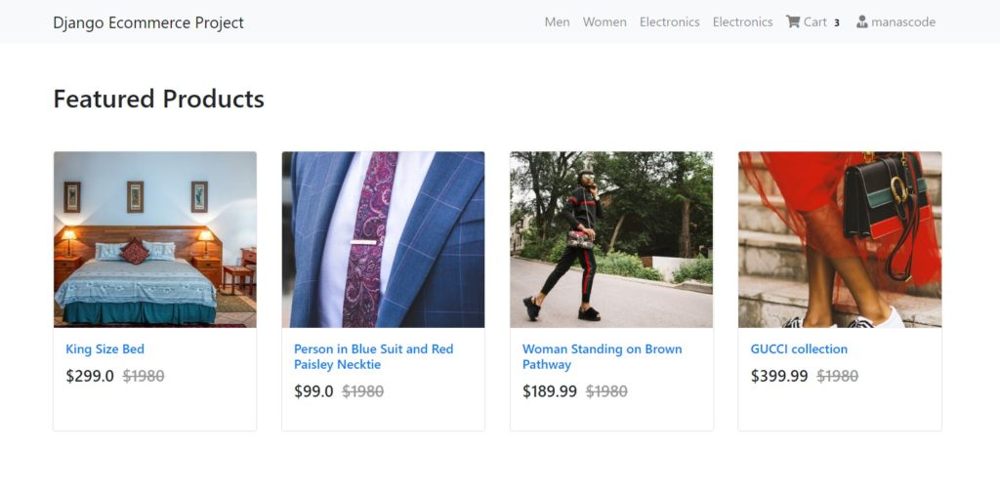

In the last part, we stopped at **Adding Items to Cart** and **Removing items from cart**. Now in this part we are going to learn managing every single items in the cart, and in Order . Use **Django-allauth** to quickly add the **Register and Login ability in our Django ecommerce project** to the user so they can add the item to the cart.

In this post you may be see some more html part rather than python codes. We are going to use **Bootstrap** a css framework for rapid design. If you don’t know **Bootstrap**, then you should check out the **amazing tutorial on [w3schools](https://www.w3schools.com/bootstrap4/)** or **[Bootstap official documentation](https://getbootstrap.com/)**.

Learn Bootstrap is not necessary, but having the knowledge of HTML and CSS will help you make the design look better. For this tutorial I am going to link the GitHub repository so you can download the code and practice.

<http://bit.ly/Django-eCommerce-Github-Repo>

What we are going to learn in this blog post :
----------------------------------------------

<div class="schema-how-to wp-block-yoast-how-to-block">1. **Adding ability to increase and decrease the Product quantity**
2. **Showing the Cart Items in the Cart Page**
3. **Designing our website using Bootstrap** You can skip this part if you don’t like
4. **Adding Registration and Login Feature in our Django Project**

</div>If you missed the previous part of this tutorial series, you can either go back to home page of this blog or use this links to navigate to the corresponding tutorial.

- [Adding search filters in Django eCommerce website](/adding-search-filters-in-django-e-commerce-website/)
- [Real world SAAS application in Django tutorial](http://manascode.com/real-world-saas-application-in-django-tutorial/)
- [Build a SaaS Application in Django 3.0| SaaS Series](/build-a-saa-s-application-in-django-3-0-saa-s-series/)
- [Stripe Payment Gateway Integration in Django eCommerce Website](http://manascode.com/stripe-payment-gateway-integration-in-django-ecommerce-website/)
- [Django eCommerce tutorial part two](http://manascode.com/django-ecommerce-tutorial-part-two-django-allauth/)

So. let’s start the tutorial step by step as we do. Grab a cup of coffee ☕ and start coding.

# 1. Showing the Cart Items in the Cart Page 
-------------------------------------------

In the last part we were able to add items to the cart and in Order but we are able to see that which item we have in the cart and how many quantities we have.

Before we get started make sure you clone the repo from github &gt;&gt;

[repo link](https://github.com/imanaspaul/Django-eCommerce-tutorial-manascode)

For showing the cart items to the corresponding user, we need to create view for the **Cart View Page**. So, the basic stuff, create a new view in the Cart app, we are calling the view as **`CartView`** and we are going to use **`Function based views`** for now but letter on we are going to **`convert this view in Class Based View`**

CartView Code :

```py
# Cart View

def CartView(request):

    user = request.user

    carts = Cart.objects.filter(user=user)
    orders = Order.objects.filter(user=user, ordered=False)

    if carts.exists():
        order = orders[0]
        return render(request, 'cart/home.html', {"carts": carts, 'order': order})
		
    else:
        messages.warning(request, "You do not have an active order")
        return redirect("core:home")
```

In the code, first we are filtering the **Cart and Order model** by using the user in request object. Then we are checking that if the cart exists then we are rendering the cart home page otherwise we redirecting the home page.

And in the view we are using `<strong>The messages framework</strong>` so don’t forget to import in the views.py file.

```py
from django.contrib import messages
```
we can see that now we need to create a new Template for the CART view page called home.html . So again the same steps as we did in the last part. Create a new folder in the cart app called `templates` then create another folder inside the new templates folder called as same as your app name. Now create the `home.html` file inside the folder.

If you wants to make only templates directory you can do that easily. but make sure you have defined the template directory path in the `settings.py` file

```py
TEMPLATES = [
    {
        'BACKEND': 'django.template.backends.django.DjangoTemplates',
        'DIRS': [],  # Your template path will be here.
        'APP_DIRS': True,
        'OPTIONS': {
            'context_processors': [
                'django.template.context_processors.debug',
                'django.template.context_processors.request',
                'django.contrib.auth.context_processors.auth',
                'django.contrib.messages.context_processors.messages',
            ],
        },
    },
]
```
# 2. Designing our website using Bootstrap 
-----------------------------------------

Now we need to design the home page and product detail. To make the design organized we are going to split the template into different parts. Instead of write all the code here I have uploaded all the codes to github, you can get the code from there.

<http://bit.ly/Django-eCommerce-Github-Repo>


But there is an import thing that should be discussed in the post itself, that is **how we are going to show the cart count on the nav bar** as we have seen on other eCommerce website’s out there.

###  Showing the cart count in the navbar.

We have added the cart functionality in the previous tutorial. So now we need to **add the product count in the navbar** so show the user that how many products they have added in their Cart.

To do that, there are various way to do this. But we are going to use template tag, with that you will going to **learn how to create a custom template tag in Django.**

So in the cart app create a new folder called **`templatetags`**, and inside the folder create a new python file called **`cart_tag.py`**. Now add these lines of code into the python file you have created.

```py
from django import template
from cart.models import Order

register = template.Library()

@register.filter
def cart_total(user):
    order = Order.objects.filter(user=user, ordered=False)

    if order.exists():
    	return order[0].orderitems.count()
    else:
    	return 0
```
In the python file, we are first importing the tamplate from django and then importing the model we need for this functionality. Then we are creating an instance of the **template.Library()** method. Now to register the template we are using the decorators called **`@register.filter`** then writing a function which will return the total count of the order item we have in our order.

So now we can use the template in our template. The template tag will like this, It will called as the name you given for the python file you created.

You can read more about the to **create a custom template tag in Django**‘s offical documentation to get in depth knowledge.

```html
   <li class="nav-item">
        <a class="nav-link" href="">
          <i class="fa fa-shopping-cart"></i> Cart
          <span class="badge badge-light">{{ request.user| cart_total }}</span>
        </a>
    </li>
```
```py
{{ request.user| cart_total }}
```
### Creating the cart home page.

In this step, we are going to use the Bootstrap 4 framework to design the cart page. We are just using html table for the structure.

Cart home page code :

```py
 
<div class="container my-5">
    <div class="my-5">
        <h2>You Cart</h2>
    </div>
    <table class="table table-hover">
        <thead>
            <tr>
                <th scope="col">#</th>
                <th scope="col">Product Name</th>
                <th scope="col">Quantity</th>
                <th scope="col">Price</th>
            </tr>
        </thead>
        <tbody>
            
            <tr>
                <th scope="row">{{ forloop.counter }}</th>
                <td>{{ cart.item.name }}</td>
                <td>{{ cart.quantity }}</td>
                <td>$ Total </td>
            </tr>
            
            <tr>
                <th scope="row"></th>
                <td colspan="2">Total</td>
                <td>$10000</td>
            </tr>
            <tr>
                <th scope="row"></th>
                <td colspan="3" class="text-right ">
                    <button class="btn btn-success mr-4">Proceed To Checkout</button>
                </td>
            </tr>
        </tbody>
    </table>
</div>


```
On the above code, if you look carefully we are hard coded the total price in the table. Now we need to create some methods which will calculate the total in our cart.

###  Calculating the total Price of all Product

To calculate the total price of all products that we have in our cart, we have to create some function. We can count the total in the cart view but use the total price in other places we have write the same code again.

> So we are going follow the **DRY ( DO NOT REPEAT YOURSELF )** to avoid writing the same code again. We are going to write those functions in our models.py file like `get_absolute_url()` method, so we can use it anywhere.

Now open the models.py file in cart app and create a new method called `get_total` in Cart Model. The function will look like this.

```py
# Cart Model
class Cart(models.Model):
    user = models.ForeignKey(User, on_delete=models.CASCADE)
    item = models.ForeignKey(Product, on_delete=models.CASCADE)
    quantity = models.IntegerField(default=1)
    created = models.DateTimeField(auto_now_add=True)


    def __str__(self):
        return f'{self.quantity} of {self.item.name}'

    # Getting the total price 

    def get_total(self):
        return self.item.price * self.quantity
```
In the function we are multiply the **`product price`** with with **`product quantity`** and returning the value. With this function we are just calculating the each product’s price but we also need to calculate the total price of all products in our cart. So for that we need to create another method in our Order model.

[](https://siteground.com/web-hosting.htm?afimagecode=876a6d997815b4beb18c0a9d969acb39)
Now, you may think that why we are creating the function in our Order model why not in the Cart model. So to under why we are doing this, think about that we are getting only one object from the Order model where we will get all of the cart items at once.

Here is the another method for calculating the total for all the products in Cart :

```py
# Order Model
class Order(models.Model):
    orderitems  = models.ManyToManyField(Cart)
    user = models.ForeignKey(User, on_delete=models.CASCADE)
    ordered = models.BooleanField(default=False)
    created = models.DateTimeField(auto_now_add=True)

    def __str__(self):
        return self.user.username


    def get_totals(self):
        total = 0
        for order_item in self.orderitems.all():
            total += order_item.get_total()
        
        return total
```
Now the cart home page code will look like this :

```html



<div class="container my-5">
<div class="my-5">
	<h2>You Cart</h2>
</div>
<table class="table table-hover">
  <thead>
    <tr>
      <th scope="col">#</th>
      <th scope="col">Product Name</th>
      <th scope="col">Quantity</th>
      <th scope="col">Price</th>
    </tr>
  </thead>
  <tbody>
  	
    <tr>
      <th scope="row">{{ forloop.counter }}</th>
      <td>{{ cart.item.name }}</td>
      <td>{{ cart.quantity }}</td>
      <td>${{ cart.get_total }}</td>
    </tr>
	
    <tr>
      <th scope="row"></th>
      <td colspan="2">Total</td>
      <td>{{ order.get_totals| floatformat }}</td>
    </tr>
    <tr>
      <th scope="row"></th>
      <td colspan="3" class="text-right ">
        <button class="btn btn-warning mr-4">Continue Shoping</button>
        <button class="btn btn-success mr-4">Proceed To Checkout</button>
      </td>
    </tr>
  </tbody>
</table>
</div>


```
Now the page will look like this after ruining the server at port 8000.

![Managing the Cart Items, Orders and User Registration Using Django AllOuth]./uploads/2019/09/cart-page-manascode-1024x492.jpg)

# 3. Adding ability to increase and decrease the Product quantity 
----------------------------------------------------------------

Now we need to add the ability to decrease the Product Quantity in the cart page( We have the view for increasing the quantity ). First of all for this options we need to create the views so we can call that from the page, in case we can call the views by using AJAX, but to make it simple to understand we are now calling the function using django template syntax from cart page.

So in views.py file in the cart app create the view for decreasing the cart quantity called as **`decreaseCart`**. It will b same as the **`add_to_cart`** view, just it will decrease the quantity instead of increasing quantity.

The code will look like this.

```py
def decreaseCart(request, slug):
    item = get_object_or_404(Product, slug=slug)
    order_qs = Order.objects.filter(
        user=request.user,
        ordered=False
    )
    if order_qs.exists():
        order = order_qs[0]
        # check if the order item is in the order
        if order.orderitems.filter(item__slug=item.slug).exists():
            order_item = Cart.objects.filter(
                item=item,
                user=request.user
            )[0]
            if order_item.quantity > 1:
                order_item.quantity -= 1
                order_item.save()
            else:
                order.orderitems.remove(order_item)
                order_item.delete()
            messages.info(request, f"{item.name} quantity has updated.")
            return redirect("mainapp:cart-home")
        else:
            messages.info(request, f"{item.name} quantity has updated.")
            return redirect("mainapp:cart-home")
    else:
        messages.info(request, "You do not have an active order")
        return redirect("mainapp:cart-home")

```
Now we need two button in cart page where user can increase and decrease the button. The code will look like this.

```html



<div class="container my-5">
<div class="my-5">
	<h2>Your Cart</h2>
</div>
<table class="table table-hover">
  <thead>
    <tr>
      <th scope="col">#</th>
      <th scope="col">Product Name</th>
      <th scope="col">Quantity</th>
      <th scope="col">Price</th>
    </tr>
  </thead>
  <tbody>
  	
    <tr>
      <th scope="row">{{ forloop.counter }}</th>
      <td>{{ cart.item.name }}</td>
      <td>
        <a class="mr-2" href=""><span class="badge badge-light"><i class="fas fa-minus"></i></span></a>
      {{ cart.quantity }}
      <a class="ml-2" href="" ><span class="badge badge-light"><i class="fas fa-plus"></i></span></a>
      </td>
      <td>${{ cart.get_total }}</td>
    </tr>
	
    <tr>
      <th scope="row"></th> 
      <td colspan="2">Total</td>
      <td>${{ order.get_totals| floatformat:2 }}</td>
    </tr>
    <tr>
      <th scope="row"></th>
      <td colspan="3" class="text-right ">
        <a href="" class="btn btn-warning mr-4" >Continue Shoping</a>
        <button class="btn btn-success mr-4">Proceed To Checkout</button>
      </td>
    </tr>
  </tbody>
</table>
</div>


```
After adding them correctly, your server should auto reload if you have running the server. And it should look like this. Incase you may be missed the base.html and it will through an error. So make sure you add the base.html, you can get the file from github link

![Django cart manascode.com]./uploads/2019/09/cart-increase-django-tutorial-manascode-1-1024x514.jpg)</Now as you can see everything is going fine but we have the total price something look like this **$5599.860000000001** but we want to get the last two decimal places for the total price. So to do that go back to the **get\_total** method we have created in our **models.py** file and add this lines of code to get the value.

You can use Django template tag **`floatformat`** to make it much easier. You can read about the template tag here &gt; [Django Buitins template tags.](https://docs.djangoproject.com/en/2.2/ref/templates/builtins/)

We have used for the grad total in the cart home page.

```py

    def get_total(self):
        total = self.item.price * self.quantity
        floattotal = float("{0:.2f}".format(total))
        return floattotal
```
# 4. Adding Registration and Login Feature in our Django Project 
---------------------------------------------------------------

As of now we are using our super user credentials to check the functionality that we have created with these two tutorial. Now we need to let the other users to sing up and create new cart and make the order.

To do that we are going to use the **Django allauth**  third party app to make our workflow much easier. Adding Django allauth is easy, I hope you guys know about that, if you don’t then I would suggest first go the the **[Django Allauth documentation](https://django-allauth.readthedocs.io/en/latest/installation.html)** to know more about it. But here is how we add the authencation in our eCommerce app.

### 1.Step One

```bash
pipenv install django-allauth
```
### 2.Step Two

In **`settings.py`** add this lines of code.

```py
import os

# Build paths inside the project like this: os.path.join(BASE_DIR, ...)
BASE_DIR = os.path.dirname(os.path.dirname(os.path.abspath(__file__)))


# Quick-start development settings - unsuitable for production
# See https://docs.djangoproject.com/en/2.2/howto/deployment/checklist/

# SECURITY WARNING: keep the secret key used in production secret!
SECRET_KEY = 'a%zlhr+b0mze-t5dxt%p1g=0a8-^njg#0o*@$gvp98%w=5op5u'

# SECURITY WARNING: don't run with debug turned on in production!
DEBUG = True

ALLOWED_HOSTS = []


# Application definition

INSTALLED_APPS = [
    'django.contrib.admin',
    'django.contrib.auth',
    'django.contrib.contenttypes',
    'django.contrib.sessions',
    'django.contrib.messages',
    'django.contrib.staticfiles',
   
    'django.contrib.sites',

    'allauth',
    'allauth.account',
    'allauth.socialaccount',
    'cart',
    'products'
]

MIDDLEWARE = [
    'django.middleware.security.SecurityMiddleware',
    'django.contrib.sessions.middleware.SessionMiddleware',
    'django.middleware.common.CommonMiddleware',
    'django.middleware.csrf.CsrfViewMiddleware',
    'django.contrib.auth.middleware.AuthenticationMiddleware',
    'django.contrib.messages.middleware.MessageMiddleware',
    'django.middleware.clickjacking.XFrameOptionsMiddleware',
]

ROOT_URLCONF = 'ecommerce.urls'

TEMPLATES = [
    {
        'BACKEND': 'django.template.backends.django.DjangoTemplates',
        'DIRS': [],
        'APP_DIRS': True,
        'OPTIONS': {
            'context_processors': [
                'django.template.context_processors.debug',
                'django.template.context_processors.request',   
                'django.contrib.auth.context_processors.auth',
                'django.contrib.messages.context_processors.messages',
            ],
        },
    },
]

AUTHENTICATION_BACKENDS = (
    'django.contrib.auth.backends.ModelBackend',
    'allauth.account.auth_backends.AuthenticationBackend',
    
)

WSGI_APPLICATION = 'ecommerce.wsgi.application'


# Database
# https://docs.djangoproject.com/en/2.2/ref/settings/#databases

DATABASES = {
    'default': {
        'ENGINE': 'django.db.backends.sqlite3',
        'NAME': os.path.join(BASE_DIR, 'db.sqlite3'),
    }
}


# Password validation
# https://docs.djangoproject.com/en/2.2/ref/settings/#auth-password-validators

AUTH_PASSWORD_VALIDATORS = [
    {
        'NAME': 'django.contrib.auth.password_validation.UserAttributeSimilarityValidator',
    },
    {
        'NAME': 'django.contrib.auth.password_validation.MinimumLengthValidator',
    },
    {
        'NAME': 'django.contrib.auth.password_validation.CommonPasswordValidator',
    },
    {
        'NAME': 'django.contrib.auth.password_validation.NumericPasswordValidator',
    },
]


# Internationalization
# https://docs.djangoproject.com/en/2.2/topics/i18n/

LANGUAGE_CODE = 'en-us'

TIME_ZONE = 'UTC'

USE_I18N = True

USE_L10N = True

USE_TZ = True


# Static files (CSS, JavaScript, Images)
# https://docs.djangoproject.com/en/2.2/howto/static-files/

STATIC_URL = '/static/'
MEDIA_URL = '/media/'
MEDIA_ROOT = os.path.join(BASE_DIR, 'media')
STATIC_ROOT = os.path.join(BASE_DIR, 'staic')

SITE_ID = 1
LOGIN_REDIRECT_URL = '/'
```
### 3.Step Three

Add path to the login and sign up page in urls.py file in our main project.

```py
 path('accounts/', include('allauth.urls')),
```
### 4.Step Four

Change the navbar.html file to code to these codes. Here we just add a if block to know the user is logged in or not and based on that we are just showing the different menu.

Here is the *navbar.html* code :

```html


<nav class="navbar navbar-expand-lg navbar-light bg-light">
  <div class="container">
  <a class="navbar-brand" href="/">Django Ecommerce Project</a>
  <button class="navbar-toggler" type="button" data-toggle="collapse" data-target="#navbarNav" aria-controls="navbarNav" aria-expanded="false" aria-label="Toggle navigation">
    <span class="navbar-toggler-icon"></span>
  </button>
  <div class="collapse navbar-collapse" id="navbarNav">
    <ul class="navbar-nav">
      <li class="nav-item active"class="nav-item">
        <a class="nav-link" href="#">Men <span class="sr-only">(current)</span></a>
      </li>
      <li class="nav-item">
        <a class="nav-link" href="#">Women</a>
      </li>
      <li class="nav-item">
        <a class="nav-link" href="#">Electronics</a>
      </li>
       <li class="nav-item">
        <a class="nav-link" href="#">Electronics</a>
      </li>
      
      <li class="nav-item">
        <a class="nav-link" href="">
          <i class="fa fa-shopping-cart"></i> Cart
          <span class="badge badge-light">{{ request.user| cart_total }}</span>
        </a>
      </li>
       <li class="nav-item">
        <a class="nav-link" href="/accounts">
          <i class="fas fa-user-tie"></i> {{ request.user.username }}
        </a>
      </li>
      
       <li class="nav-item">
        <a  class="btn btn-primary" href="/accounts/login/">Login / Register</a>
      </li>
      
    </ul>
  </div>
  </div>
</nav>

```


Now the main website will look like this after saving all these changes.


Ok, that’s it for this part. We are going to focus **payment gateways**, **styling our register and login page, filter by category and adding search feature in our project.**

Thank you for reading our post. stay tuned for next update. And sorry for the delay. Hope you learned something from this part, 
**`please let me know in comment section`**. See you with part three soon.